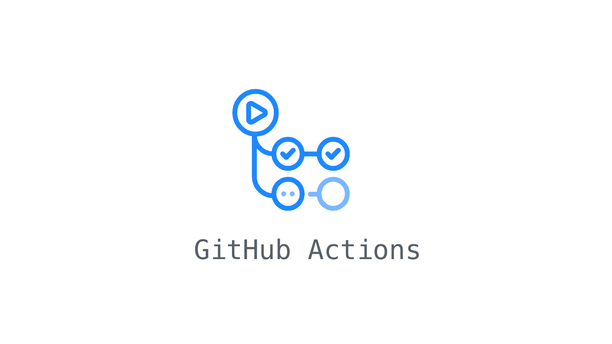

# ActionBot CI/CD
⏰ **自动更新源码发布容器**

[![Contributors][contributors-shield]][contributors-url]
[![Forks][forks-shield]][forks-url]
[![Stargazers][stars-shield]][stars-url]
[![Issues][issues-shield]][issues-url]

<br />
<p align="center">
  <a href="https://github.com/bigbugcc/ActionBot">
    
  </a>
  <h3 align="center">ActionBot CI/CD</h3>
  <p align="center">
    👉 自动更新源码发布容器
 [<a herf="https://github.com/bigbugcc/ActionBot/releases"> Releases </a>] 👈
    <br />
    <a href="https://hub.docker.com/u/bigbugcc">DockerHub</a>
    ·
    <a href="https://github.com/bigbugcc/ActionBot/actions">Action</a>
    ·
    <a href="https://github.com/bigbugcc/ActionBot/issues">提出新特性</a>
  </p>
</p>

## 目录
- [ActionBot Param](#ActionBot-Param)
- [3x-ui Docker](#3x-ui-Docker)
- [WarpPlus Docker](#WarpPlus-Docker)


## 项目列表statistics
|           项目         |         类别         |         Repo         |        Action         |            状态          |              统计            |              入口             |
| :------------------------: | :---------------------: | :-------------------: | :-------------------: | :--------------------------: | :--------------------------: | :--------------------------: |
|          3x-ui        |  Docker | [🚩](https://github.com/MHSanaei/3x-ui) |[🍕](https://github.com/bigbugcc/ActionBot/actions/workflows/3x-ui-Docker.yml) |  |   |[✔](https://hub.docker.com/r/bigbugcc/3x-ui)
|      Admin.NET     |  镜像库  | [🚩](https://gitee.com/zuohuaijun/Admin.NET) |[🍕](https://github.com/bigbugcc/ActionBot/actions/workflows/Admin.NET-Sync.yml) |  |   |  [✔](https://github.com/bigbugcc/Admin.NET)
|         OpenWRT       |  Build  | [🚩](https://github.com/coolsnowwolf/lede) |[🍕](https://github.com/bigbugcc/openwrts/actions/workflows/ActionTrigger.yml) |  |  |[✔](https://github.com/bigbugcc/OpenWrts)
|   WarpPlus-Traffic    |  Task   | [🚩](https://github.com/bigbugcc/ActionBot) |[🍕](https://github.com/bigbugcc/ActionBot/actions/workflows/WarpPlus-Traffic.yml) |  |  | [✔](https://github.com/bigbugcc/ActionBot/blob/main/bin/warp/warp.py)
|   WarpPlus-Docker     |  Docker | [🚩](https://github.com/bepass-org/warp-plus) |[🍕](https://github.com/bigbugcc/ActionBot/actions/workflows/WarpPlus-Docker.yml) |  |  |[✔](https://hub.docker.com/r/bigbugcc/warp-plus)|

# ActionBot-Param

### Hello
ActionBot 是一个监听自动化执行项目，支持两种运行模式：
- **Trigger 模式**（默认）：检测当前仓库下的`Workflow`并自动根据条件批量触发它们
- **Check 模式**：单个工作流内独立检查源仓库更新，若无更新则自动取消当前工作流运行

可用于跨平台`(GitHub <-> Gitee)`同步仓库、自动发布Releases、编译Docker和定时任务等；对于一些没有提供适合自己的容器或应用进行二次独立发布[Demo](#3x-ui-Docker)。

### Usage

#### Trigger 模式（批量触发其它 Workflow）
```yaml
    steps:
    - name: Checkout
      uses: actions/checkout@v4

    - name: AutoTrigger
      uses: bigbugcc/ActionBot@main
```

#### Check 模式（单工作流检查更新）
cron 定时触发后，自动抓取源仓库最新 commitId 并与缓存比对；若一致则直接取消当前工作流，若不一致则继续执行后续步骤。
```yaml
name: 3x-ui-Docker
on:
  schedule:
    - cron: '0 */6 * * *'
  workflow_dispatch:

jobs:
  build:
    runs-on: ubuntu-latest
    steps:
      - uses: actions/checkout@v4

      - name: Check for updates
        uses: bigbugcc/ActionBot@main
        with:
          mode: 'check'
          repo_url: 'https://github.com/MHSanaei/3x-ui'
          branch: 'main'

      # 以下步骤仅在源仓库有更新时执行，无更新时工作流已被自动取消
      - name: Build and Push Docker
        run: |
          echo "Source updated, building..."
```

### Action Param
| 参数 | 说明 | 必填 | 默认值 |
| --- | --- | --- | --- |
| `token` | 用于认证的 GitHub Token | ✅ | `${{ github.token }}` |
| `repository` | 仓库名称 | ✅ | `${{ github.repository }}` |
| `workflow` | 当前工作流名称 | ✅ | `${{ github.workflow }}` |
| `workspace` | 当前仓库工作目录 | ✅ | `${{ github.workspace }}` |
| `mode` | 运行模式：`trigger`（批量触发）/ `check`（单工作流检查） | ❌ | `trigger` |
| `repo_url` | 监听的仓库地址（check 模式使用） | ❌ | `''` |
| `branch` | 监听的分支名称，空则为仓库默认分支 | ❌ | `''` |

### Action Output
| 输出 | 说明 |
| --- | --- |
| `updated` | 源仓库是否有更新 `true` / `false`（仅 check 模式） |

### Trigger Param
```yaml
env:
  repo_url: '' 
  force_active: 1
```
- repo_url : 监听的仓库地址，根据该地址判断commitId是否变化，而触发当前`Workflow`；可以为空。
- force_active : `0，1，2`  
    `0` -> 默认值，会根据repo的值进行判断；   
    `1` -> 强制执行当前`Workflow`，不判断CommitId；  
    `2` -> 跳过执行，即使`Repo`不为空也会直接跳过；

# ActionBot Example
## 3x-ui-Docker
Docker Usage  

- 项目地址 https://github.com/MHSanaei/3x-ui
```bash
docker run -itd \
   -e XRAY_VMESS_AEAD_FORCED=false \
   -v $PWD/db/:/etc/x-ui/ \
   -v $PWD/cert/:/root/cert/ \
   --network=host \
   --restart=unless-stopped \
   --name 3x-ui \
   bigbugcc/3x-ui:latest
```
#### Default Setting
- **Port:** 2053
- **TimeZone:** Asia/Shanghai
- **Username & Password:** It will be generated randomly if you skip modifying.
- **Database Path:**
  - /etc/x-ui/x-ui.db
- **Xray Config Path:**
  - /usr/local/x-ui/bin/config.json
- **Web Panel Path w/o Deploying SSL:**
  - http://ip:2053/panel
  - http://domain:2053/panel
- **Web Panel Path w/ Deploying SSL:**
  - https://domain:2053/panel

## WarpPlus-Docker
Repo：https://github.com/bigbugcc/ActionBot  
warp-plus：https://github.com/bepass-org/warp-plus

### Default Setting
- **Port:** 1080
- **Warp Config Path:**
  - /etc/warp/config.json
### Parameter
`/etc/warp/config.json`
```shell
NAME
  warp-plus

FLAGS
  -4                       only use IPv4 for random warp endpoint
  -6                       only use IPv6 for random warp endpoint
  -v, --verbose            enable verbose logging
  -b, --bind STRING        socks bind address (default: 127.0.0.1:8086)
  -e, --endpoint STRING    warp endpoint
  -k, --key STRING         warp key
      --dns STRING         DNS address (default: 1.1.1.1)
      --gool               enable gool mode (warp in warp)
      --cfon               enable psiphon mode (must provide country as well)
      --country STRING     psiphon country code (valid values: [AT BE BG BR CA CH CZ DE DK EE ES FI FR GB HR HU IE IN IT JP LV NL NO PL PT RO RS SE SG SK UA US]) (default: AT)
      --scan               enable warp scanning
      --rtt DURATION       scanner rtt limit (default: 1s)
      --cache-dir STRING   directory to store generated profiles
      --tun-experimental   enable tun interface (experimental)
      --fwmark UINT        set linux firewall mark for tun mode (default: 4981)
      --reserved STRING    override wireguard reserved value (format: '1,2,3')
      --wgconf STRING      path to a normal wireguard config
  -c, --config STRING      path to config file
      --version            displays version number
```
### Usage
Modify config '/etc/warp/config.json'

```bash
docker run -itd \
   -v /etc/warp/:/etc/warp/ \
   --network=host \
   --restart=unless-stopped \
   --name warp-plus \
   bigbugcc/warp-plus:latest
```


<!-- links -->
[contributors-shield]: https://img.shields.io/github/contributors/bigbugcc/ActionBot?style=flat-square
[contributors-url]: https://github.com/bigbugcc/ActionBot/graphs/contributors
[forks-shield]: https://img.shields.io/github/forks/bigbugcc/ActionBot?style=flat-square
[forks-url]: https://github.com/bigbugcc/ActionBot/network/members
[stars-shield]: https://img.shields.io/github/stars/bigbugcc/ActionBot?style=flat-square
[stars-url]: https://github.com/bigbugcc/ActionBot/stargazers
[issues-shield]: https://img.shields.io/github/issues/bigbugcc/ActionBot?style=flat-square
[issues-url]: https://img.shields.io/github/issues/bigbugcc/ActionBot